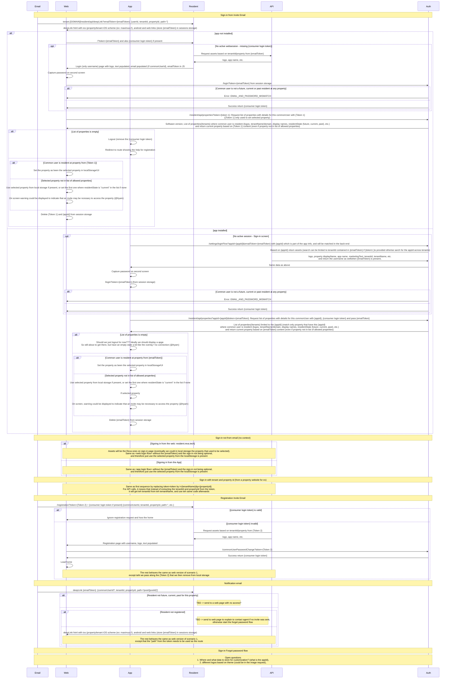

# Sequence diagrams

This sequence diagram can be seen in both github and vscode. Check [this for instructions](./instructions.md)

```mermaid
sequenceDiagram
    participant Email
    participant Web
    participant App
    participant Resident
    participant API
    participant Auth

Note over Email, Auth: Sign-in from Invite Email

    Email->>Resident: tenant.[DOMAIN]/resident/api/deepLink?emailToken={emailToken}: {userId, tenantId, propertyId, path=''}
    Resident->>Web: deepLink html with ios (property/tenant iOS scheme (ex: maximus://), android and web links (store {emailToken} in sessions storage)

    alt app not installed

      %% <web login flow>
      Web->>Resident: /?token={emailToken} and also {consumer login token} if present

      opt No active websession - missing {consumer login token}
        Resident->>API: Request assets based on tenantId/property from {emailToken}
        API->>Resident:  logo, app name, etc.
        Resident->>Web: Login (only username) page with logo, text populated, email populated (if commonUserId), emailToken in JS

        %% <section 2>
        Web->>Web: Capture password on second screen
        Web->>Auth: /login?token={emailToken} from session storage

        alt Common user is not a future, current or past resident at any property
          Auth->>Web: Error: EMAIL_AND_PASSWORD_MISMATCH
        else
          Auth->>Web: Success return {consumer login token}
        end
        %% </section 2>
      end

      Web->>Auth: /resident/api/properties?token={token 1}: Request list of properties with details for this commonUser with {Token 1}<br/> ({Token 1} only used to set selected property)
      Auth->>Web: Software version, List of properties(/tenants) where common user is resident (logos, tenantName/domain, display names, residentState (future, current, past), etc.) <br/>and return current property based on {Token 1} content (even if property not in list of allowed properties)

      %% <section 1>
      alt List of properties is empty
        App->>App: Logout (remove the {consumer login token}
        App->>App: Redirect to route showing the help for registration

      else
        alt Common user is resident at property from {Token 1}
          Web->>Web: Set the property as been the selected property in localStorage/UI

        else Selected property not in list of allowed properties
          Web->>Web: Use selected property from local storage if present, or set the first one where residentState is "current" in the list if none
          Web->>Web: On screen warning could be displayed to indicate that an invite may be ncessary to access the property (@Ityam)
        end

        Web->>Web: Delete {Token 1} and {appId} from session storage
      end
      %% </section 1>
      %% </web login flow>

    else app installed

      %% <app login flow>
      opt No active session - Sign-in screen
        App->>Auth: /settings/loginFlow?appId={appId}&emailToken={emailToken} with {appId} which is part of the app Info, and will be matched in the back-end
        Auth->API: Based on {appId} return assets (search can be limited to tenantId contained in {emailToken} if {token1 }is provided otherise sarch for the appId across tenants)
        API->>Auth:  logo, property displayName, app name, marketingText, tenantId, tenantName, etc. <br/>and return the username as wellwhen {emailToken} is present,
        Auth->>App: Same data as above

        %% <section 2>
        App->>App: Capture password on second screen
        App->>App: /login?token={emailToken} (from session storage)

        alt Common user is not a future, current or past resident at any property
          Auth->>Web: Error: EMAIL_AND_PASSWORD_MISMATCH
        else
          Auth->>Web: Success return {consumer login token}
        end
        %% </section 2>
      end

      App->>Auth: /resident/api/properties?appId={appId}&token={emailToken}: Request list of properties with details for this commonUser with {appId}, {consumer login token} and pass {emailToken}
      Auth->>App: List of properties(/tenants) limited to the {appId} (match only property that have this {appId} <br/>where common user is resident (logos, tenantName/domain, display names, residentState (future, current, past), etc.) <br/>and return current property based on {emailToken} content (even if property not in list of allowed properties)

      %% <section 1>
      alt List of properties is empty
        App->>App: Should we just logout for now??? Ideally we should display a apge. <br/>So still about to get there, but have an empty state a bit like the overlay f no connection (@Ityam)

      else
        alt Common user is resident at property from {emailToken}
          App->>App: Set the property as been the selected property in localStorage/UI

        else Selected property not in list of allowed properties
          App->>App: Use selected property from local storage if present, or set the first one where residentState is "current" in the list if none
          App->>App: If selected property
          App->>App: On screen, warning could be displayed to indicate that an invite may be necessary to access the property (@Ityam)
        end

        App->>App: Delete {emailToken} from session storage
      end
      %% </section 1>
      %% </app login flow>
    end

%% -----------------------------------------------------
Note over Email, Auth: Sign-in not from email (no context)
  alt Signing in from the web: resident.reva.tech
    Note over Web, API: Assets will be the Reva ones on sign-in page (eventually we could in local storage the property that used to be selected). <br/>Same as <web login flow> without the {emailToken} and the sign-in not being optional, <br/>and therefore just use the selected property from the localStorage is present
  else Signing in from the App
    Note over Web, API: Same as <app login flow> without the {emailToken} and the sign-in not being optional, <br/>and therefore just use the selected property from the localStorage is present
  end


%% -----------------------------------------------------
Note over Email, Auth: Sign-in with tenant and property id (from a property website for ex)
    Note over Web, API: Same as first sequence by replacing token=token by t={tenantName}&p={propertyId}. <br/>For API calls, it means that instead of extracting the tenantId and propertyId from the token, <br/>it will get teh tenantId from teh temantName, and use teh same code afterwards


%% -----------------------------------------------------
Note over Email, Auth: Registration Invite Email
    Email->>Resident: /registration?token={Token 2} + {consumer login token if present} {commonUserId, tenantId, propertyId, path='', etc.}

    alt {consumer login token} is valid
      Resident->>Web: Ignore registration request and how the home
    else {consumer login token} invalid
      Resident->API: Request assets based on tenantId/property from {Token 2}
      API->>Resident:  logo, app name, etc.
      Resident->>Web: Registration page with username, logo, text populated

      Web->>Auth: /commonUserPasswordChange?token={Token 2}
      Auth->>Web: Success return {consumer login token}

      Web->>Web: Load home

      Note over Web, API: The rest behaves the same as web version of scenario 1, <br/>except taht we pass along the {Token 2} that we then remove from local storage
    end


%% -----------------------------------------------------
Note over Email, Auth: Notification email

    Email->>Resident: deepLink {emailToken}: {commonUserId?, tenantId, propertyId, path='/post/{postId}'}
    alt Resident not future, current, past for this property
      Note right of Resident: TBD -> send to a web page with no access?
    else
      alt Resident not registered
        Note right of Resident: TBD -> send to web page to explain to contact agent if no invite was sent, <br/>otherwise start the forget password flow
      else
        Resident->>Web: deepLink html with ios (property/tenant iOS scheme (ex: maximus://), android and web links (store {emailToken} in sessions storage)

        Note over Web, API: The rest behaves the same as web version of scenario 1, <br/>except that the "path" from the token needs to be used as the route
      end
    end


%% -----------------------------------------------------
Note over Email, Auth: Sign-in Forgot password flow


Note over Email, Auth: Open questions<br/>1. Where and what data to store for customization? (what is the appId), <br/>2. different logos based on theme (could be in the image request),
```